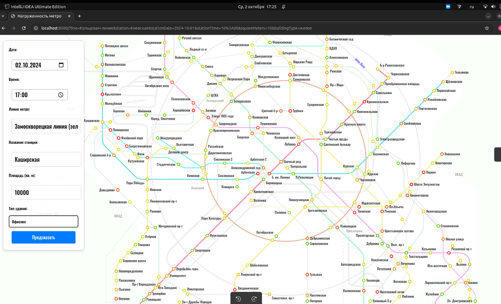

# Mostrans API

**Mostrans API** — это система для прогнозирования нагрузки на дорожную инфраструктуру и метро в зависимости от поэтажной площади застройки и времени суток. Основная цель проекта — предоставить API для анализа и предсказания транспортной загруженности, используя данные по застройкам и временным параметрам.

## Содержание

- [Функциональность](#функциональность)
- [Алгоритм предсказания нагрузки](#алгоритм-предсказания-нагрузки)
- [Требования](#требования)
- [Установка](#установка)
- [Примеры использования](#примеры-использования)
- [Телеграм бот](#описание)
- [Документация](#документация)
- [Авторство](#авторство)
## Презентация: [МосТрансПроект.pdf](presentation/МосТрансПрокт.pdf)

## Функциональность

Проект состоит из следующих компонентов:

1. **PostgreSQL Master и Replica** — основная база данных и её реплика для обеспечения отказоустойчивости и масштабируемости.
2. **Eureka Server** — сервис регистрации микросервисов для их автоматического обнаружения.
3. **Auth Service** — сервис аутентификации, работающий в двух экземплярах для обеспечения отказоустойчивости.
4. **Predict Service** — сервис прогнозирования транспортной нагрузки.
5. **Telegram Service** — сервис для взаимодействия через Telegram.
6. **Gateway** — API-шлюз, который маршрутизирует запросы к различным сервисам.
7. **Load Balancer** — балансировщик нагрузки для распределения запросов между экземплярами Auth Service.
8. **Metro** - frontend.

Основная задача — предоставить интерфейс для получения прогноза загруженности транспортной системы на основе входных данных о площади застройки и времени.

## Алгоритм предсказания нагрузки

Predict Service использует алгоритм, основанный на поиске в ширину (BFS), для предсказания транспортной нагрузки. Этот алгоритм разработан для моделирования пассажиропотока в метро с учётом закономерностей движения пассажиров в час пик.

Шаги алгоритма:

1. Инициализация:
* Алгоритм начинается с начального распределения пассажирской нагрузки, основанного на исторических данных и площадях зданий.
* Каждой станции в метро присваивается начальное количество пассажиров.

2. Обход в ширину (BFS):
* Обход в ширину запускается от начальной станции, имитируя движение пассажиров.
* Обход следует по соединениям в метро.

3. Распределение пассажиропотока:
* По мере того, как BFS проходит по сети, к каждой станции добавляется дополнительная пассажирская нагрузка: количество пассажиров, вышедших на этой станции.
* Эта дополнительная пассажирская нагрузка распределяется по следующему правилу:
* Если текущая станция находится за пределами кольцевой линии (коричневая), то к центру движется примерно 80% дополнительной пассажирской нагрузки. Остальные 20% распределяются пропорционально другим станциям, соединённым с текущей станцией.
* Иначе пассажиропоток распределяется по всем смежным станциям равномерно.

## Требования

Перед запуском убедитесь, что у вас установлены:

- **Docker** и **Docker Compose** для запуска сервисов в контейнерах.
- **Java 17** для совместимости с Kotlin и Spring Boot.
- **Gradle** для сборки проекта.

## Установка

Для установки и запуска проекта выполните следующие шаги:

1. **Клонируйте репозиторий**:

   ```bash
   git clone https://github.com/ITech7750/mostrans_api.git
   ```

2. **Перейдите в директорию проекта**:

   ```bash
   cd mostrans_api
   ```

3. **Соберите проект с помощью Gradle**:

   ```bash
   ./gradlew build
   ```

4. **Запустите проект с помощью Docker Compose**:

   ```bash
   docker-compose up --build
   ```

Это создаст и запустит все необходимые контейнеры:

- `postgres-db-master`: основная база данных.
- `postgres-db-replica`: реплика базы данных.
- `eureka-server`: сервер регистрации.
- `auth-service-1` и `auth-service-2`: два экземпляра сервиса аутентификации.
- `predict-service`: сервис прогнозирования нагрузки.
- `telegram-service`: сервис для взаимодействия через Telegram.
- `gateway`: шлюз для API.
- `load-balancer`: балансировщик нагрузки (в стадии работы).
- `metro`: frontend

## Примеры использования

Пример запроса к Predict Service для получения прогноза транспортной нагрузки:

```bash
curl -X 'POST' \
  'http://127.0.0.1:8003/api/stations/predict' \
  -H 'accept: */*' \
  -H 'Content-Type: application/json' \
  -d '{
  "line": "Замоскворецкая линия (зелёная)",
  "name": "Каширская",
  "squareMeters": 1000,
  "buildingType": "жилое",
  "datetime": "string"
}'
```

Где:
- `floor_area` — площадь застройки в квадратных метрах.
- `time` — время для прогнозирования нагрузки.

## Telegram Bot: LoadForecastTelegramBot

### Описание
`LoadForecastTelegramBot` — это Telegram-бот, являющийся частью пользовательского интерфеса. Изначально пользователь выбирает с чем он будет работать: с конкретной частью дорожного полотна, приведенной в ТЗ, или со станцией рельсового транспорта города Москвы и его окрестностей. Затем вводится общая поэтажная площадь, дата и время. Эти данные передаются на сервер и происходит расчёт нагрузки на транспортную сеть.

### Основные функции
1. **Ручной ввод**:
   - Пользователи могут выбрать транспортный узел, линию и станцию метро или МЦД.
   - После этого предлагается выбрать тип застройки (Жилая/Коммерческая) и ввести поэтажную площадь.
   - Пользователи также могут указать дату и время.

2. **Пример (из ТЗ)**:
   - Отправляется изображение, и пользователь выбирает часть дорожного полотна.
   - После выбора бот предлагает указать тип застройки, площадь и время.

3. **Автоматическое сохранение данных**:
   - Все данные, которые вводит пользователь, сохраняются в структуре `UserData`.
   - В конце процесса бот выводит итоговый выбор пользователя и повторно предлагает начать новый процесс.

### Команды и взаимодействие
- **/start** — Запуск бота и отображение основного меню.
- **Ручной ввод** — Предлагает пользователю выбрать узел (МЦК, МЦД или метро) и пройти через серию вопросов для ввода данных.
- **Пример** — Показывает изображение и предлагает выбрать часть дорожного полотна с последующим вводом данных.

### Установка и запуск

#### Предварительные требования:
- Установленный [Java 11+](https://www.oracle.com/java/technologies/javase-jdk11-downloads.html).
- Установленный [Gradle](https://gradle.org/install/).
- Активный [Telegram Bot API Token](https://core.telegram.org/bots#6-botfather).

#### Инструкция по установке:

1. Клонируйте репозиторий проекта:
    ```bash
    git clone https://github.com/yourusername/yourproject.git
    cd yourproject
    ```

2. Установите все необходимые зависимости с помощью Gradle:
    ```bash
    gradle build
    ```

3. Убедитесь, что ваш Telegram Bot API токен правильно настроен в `application.properties`:
    ```properties
    telegram.bot.token=YOUR_TELEGRAM_BOT_TOKEN
    telegram.bot.username=YOUR_BOT_USERNAME
    ```

4. Запустите бота:
    ```bash
    gradle run
    ```

### Пример использования
- После запуска бота пользователь увидит главное меню, где можно выбрать `Ручной ввод` или `Пример`.
- Для ручного ввода бот последовательно будет запрашивать выбор транспортного узла, линии, станции, типа застройки, площади и времени.
- В примерной ветке пользователь сначала увидит изображение, затем выберет часть дорожного полотна и укажет тип застройки и площадь.

### Технические детали
- Бот построен на основе библиотеки [TelegramBots](https://github.com/rubenlagus/TelegramBots).
- Для взаимодействия с пользователем бот использует систему состояний, которая хранит текущий этап ввода данных и управляет переходами между ними.


## Frontend
Доступен по адресу:
```
http://localhost:8000/
```




## Eureka-server
```
http://eureka-server:8761/
```

## Документация
Проект использует **OpenAPI (Swagger)** для автоматической генерации документации по API. Документация доступна по адресу:

```
http://localhost:8080/swagger-ui.html
```
Для auth-service в контейнере:
```
http://127.0.0.1:8001/swagger-ui/index.html#/
```

Для predict-service в контейнере:
```
http://127.0.0.1:8003/swagger-ui/index.html#/
```

## Авторство

Разработано [iTehn7750@gmail.com](mailto:iTehn7750@gmail.com).
